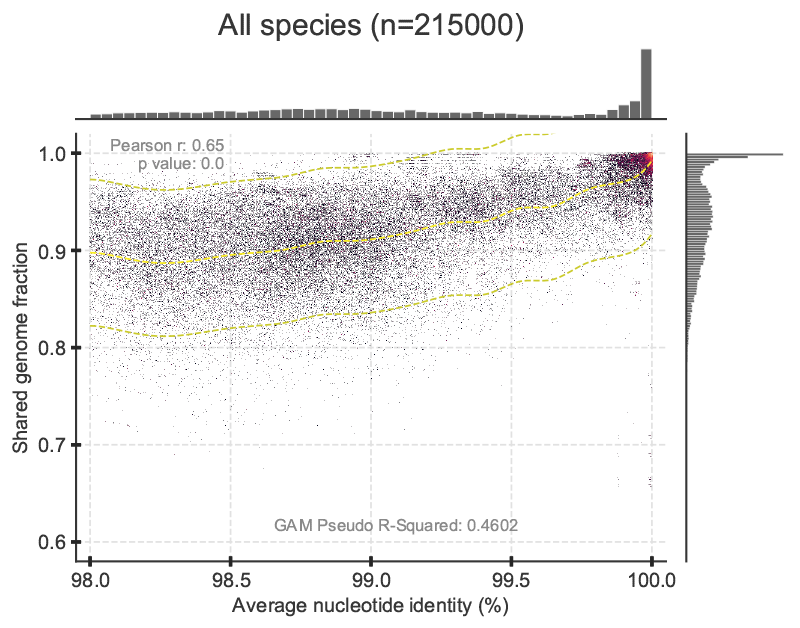

# A natural definition for a bacterial strain (May 2022)

Contains the code and workflow for the bacterial strain definition paper with Kostas Kostantinidis

# Required packages for Python.

- [pandas](https://pandas.pydata.org/) 
- [numpy](https://numpy.org/)
- [scipy](https://scipy.org/)
- [matplotlib](https://matplotlib.org/)
- [seaborn](https://seaborn.pydata.org/)
- [datashader](https://datashader.org/)
- [pygam](https://pygam.readthedocs.io/)

### References

1. Van Rossum G, Drake FL. Python 3 Reference Manual. Scotts Valley, CA: CreateSpace; 2009.
1. McKinney W, others. Data structures for statistical computing in python. In: Proceedings of the 9th Python in Science Conference. 2010. p. 51–6.
1. Harris CR, Millman KJ, van der Walt SJ, Gommers R, Virtanen P, Cournapeau D, et al. Array programming with NumPy. Nature. 2020;585:357–62.
1. Virtanen P, Gommers R, Oliphant TE, Haberland M, Reddy T, Cournapeau D, et al. SciPy 1.0: Fundamental Algorithms for Scientific Computing in Python. Nature Methods. 2020;17:261–72.
1. Hunter JD. Matplotlib: A 2D graphics environment. Computing in science & engineering. 2007;9(3):90–5.
1. Waskom ML. Seaborn: statistical data visualization. Journal of Open Source Software. 2021 Apr 6;6(60):3021.
1. James A. Bednar, Jim Crist, Joseph Cottam, and Peter Wang (2016). "Datashader: Revealing the Structure of Genuinely Big Data", 15th Python in Science Conference (SciPy 2016).
1. Servén D., Brummitt C. (2018). pyGAM: Generalized Additive Models in Python. Zenodo. DOI: 10.5281/zenodo.1208723

# STEP 01: Get the data

Download data from NCBI through the FTP access.  
NCBI provides current genome summary files for genebank or refseq.

Since this analysis is focused on bacteria only, retrive the NCBI assembly summary from from the refseq, bacteria subdirectory.

Date: Apr 20 2022

```bash
curl ftp://ftp.ncbi.nlm.nih.gov/genomes/refseq/bacteria/assembly_summary.txt -o refseq_bacteria_assembly_summary.txt
```

### Description and parsing of NCBI's assembly summary file

```bash
curl ftp://ftp.ncbi.nlm.nih.gov/genomes/README_assembly_summary.txt -o NCBI_genomes_README_assembly_summary.txt
curl ftp://ftp.ncbi.nlm.nih.gov/genomes/refseq/README.txt -o NCBI_genomes_README.txt
```
Genomes are divided into four assembly levels (Complete, Chromosome, Scaffold, and Contig).

We wrote a Python script to parse this file.
 - It creates summaries counting the number of genomes at each assembly level for each species.
 - It also creates files to download genomes for each species at each assembly level.
 - The download file can be created based on the number of genomes available at each level for each species.
 - We chose n=10 for complete genomes. This creates a download list to retrieve the genome.fna file through ftp download for only species with at least 10 complete genomes.
 - The script also filters for the "latest" version of the genome and ignores other genome versions.

```bash
python 00b_Python/01a_Parse_NCBI_Assembly_Summary.py -i refseq_bacteria_assembly_summary.txt -p bacteria -n 10
```

Output files:
 - bacteria_Chromosome_counts.tsv
 - bacteria_Chromosome_ftps.sh
 - bacteria_Complete_counts.tsv
 - bacteria_Complete_ftps.sh
 - bacteria_Contig_counts.tsv
 - bacteria_Contig_ftps.sh
 - bacteria_Scaffold_counts.tsv
 - bacteria_Scaffold_ftps.sh

### Download Complete level bacteria genomes to species directories

Download genomes:
 - Date: Apr 20 2022
 - Total Species with complete genomes >= 10: 330
 - Total genomes from these 330 species: 18,153

```bash
mkdir 01a_Complete_bacteria_genomes
while read p; do d=01a_Complete_bacteria_genomes; n=`echo -e "$p" | cut -f1`; m=`echo -e "$p" | cut -f2`; g=`echo $m | rev | cut -d/ -f1 | rev`; if [ ! -d ${d}/$n ]; then mkdir ${d}/$n; fi; curl ${m} -o ${d}/${n}/${g}; done < bacteria_Complete_ftps.sh
```

### Check we got them all

```bash
while read p; do d=01a_Complete_bacteria_genomes; n=`echo -e "$p" | cut -f1`; m=`echo -e "$p" | cut -f2`; g=`echo $m | rev | cut -d/ -f1 | rev`; if [ ! -s ${d}/$n/${g} ]; then echo $n $g "NOT COMPLETE DOWNLOADING"; curl ${m} -o ${d}/${n}/${g}; fi; done < bacteria_Complete_ftps.sh
```

*NOTE: One species, Haemophilus_ducreyi ends up with brackets in the directory name like this: [Haemophilus]_ducreyi. Rename this before proceeding.*

```bash
mv 01a_Complete_bacteria_genomes/\[Haemophilus\]_ducreyi/ 01a_Complete_bacteria_genomes/Haemophilus_ducreyi
```

### Unzip them

*Used a PBS script on PACE cluster at GA Tech to gunzip genomes.*

```bash
mkdir 00c_log
for d in 01a_Complete_bacteria_genomes/*; do qsub -v f=${d}/* 00a_PBS/01a_gunzip.pbs; done
```

# STEP 02: Run All vs All fastANI for each species

April 21 2022

### Run one vs all fastANI among genomes of each species.

*Continued working on PACE cluster at GA Tech. Submitted a qsub job for each species and then used GNU parallel within each pbs script to execute one vs all fastANI processes for each genome. Concatenated them afterwords to create an all vs all fastANI file. This seemed to work way faster than the all vs all option for fastANI - especially for the species with lots of genomes.*

```bash
mkdir 02a_fastANI_OnevAll
for d in 01a_Complete_bacteria_genomes/*; do n=`basename $d`; x=`echo ${d}/*fna | wc -w`; if [ ${x} -lt 100 ]; then q=02a_fastANI_reg.pbs; else q=02b_fastANI_high.pbs; fi; qsub -v fDir=${d},oDir=02a_fastANI_OnevAll,n=${n} 00a_PBS/${q}; done
```

#### Concatenate files

```bash
mkdir 02c_fastANI_AllvAll
for d in 02a_fastANI_OnevAll/*; do n=`basename $d`; cat ${d}/* >> 02c_fastANI_AllvAll/${n}.ani; echo $d; done
cat 02c_fastANI_AllvAll/*.ani >> 02d_fastANI_Complete_All.ani
```

#### Plots

##### Plots for each species:

Create separate plots for each species with x-axis minimum of 95% and 98% ANI.

```bash
mkdir 02e_species_plots_95 02e_species_plots_98
python 02f_fastANI_scatter_pyGAM.py -i fastANI_Complete_All.ani -o 02e_species_plots_95/ANI_95_scatter -s True
python 02f_fastANI_scatter_pyGAM -i fastANI_Complete_All.ani -o 02e_species_plots_98/ANI_98_scatter -xmin 98 -t 0.5 -s True
```

##### Plots for all 330 species combined:

Create a plot with all data from all species combined and x-axis minimum of 95% ANI.

```bash
python 02f_fastANI_scatter_pyGAM.py -i fastANI_Complete_All.ani -o ANI_95_scatter -l True -g True
```


Create a plot with all data from all species combined and x-axis minimum of 98% ANI.

```bash
python 02f_fastANI_scatter_pyGAM.py -i fastANI_Complete_All.ani -o ANI_98_scatter -xmin 98 -t 0.5 -l True -g True
```


Create a plot with subsampled data. r=10 random selects 10 genomes from each species and e=100 repeats the random selection 100 times. Random sampling is with replacement.

```bash
python bacterial_strain_definition/02f_fastANI_scatter_pyGAM.py -i fastANI_Complete_All.ani -xmin 98 -t 0.5 -g True -r 10 -e 100 -l True -o ANI_98_subsamples_r10_e100
````



#### Range fraction count
```bash
python 02h_fastANI_fraction_in_range.py -i fastANI_Complete_All.ani -xmin 99.2 -xmax 99.8
```

Genome pair counts:
 - (A) Genome pairs in range [99.2, 99.8]: 235527
 - (B) Total genome pairs: 4455818
 - (C) Genome pairs >= 95% ANI: 4344982
 - (D) Genome pairs >= 96% ANI: 4280042
 - (E) Genome pairs >= 97% ANI: 3637508
 - (F) Genome pairs >= 98% ANI: 2677076
 - (G) Genome pairs >= 99% ANI: 934658

Fraction of A in B-G:
 - (A) / (B) = 0.0529
 - (A) / (C) = 0.0542
 - (A) / (D) = 0.0550
 - (A) / (E) = 0.0647
 - (A) / (F) = 0.0880
 - (A) / (G) = 0.2520

# STEP 03 ## Dorian

We can add dorians work here.
