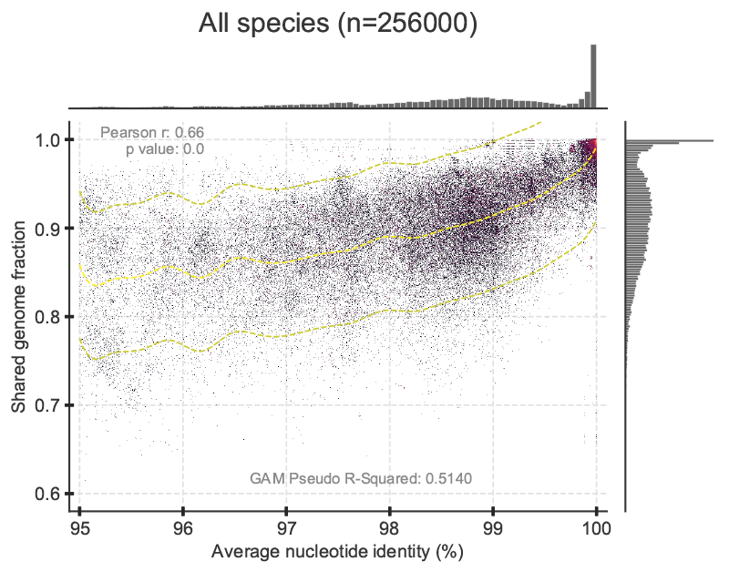

# A natural definition for a bacterial strain (May 2022)

Contains the code and workflow for the bacterial strain definition paper with Kostas Kostantinidis

# Required dependencies

- [fastANI](https://github.com/ParBLiSS/FastANI)
- [mlst](https://github.com/tseemann/mlst)

### References

1. Jain C, Rodriguez-R LM, Phillippy AM, Konstantinidis KT, Aluru S. High throughput ANI analysis of 90K prokaryotic genomes reveals clear species boundaries. Nature communications. 2018 Nov 30;9(1):1-8.
2. Jolley, Keith A., and Martin CJ Maiden. "BIGSdb: scalable analysis of bacterial genome variation at the population level." BMC bioinformatics 11.1 (2010): 1-11.
3. Seemann T, mlst Github https://github.com/tseemann/mlst

# Required packages for Python.

- [pandas](https://pandas.pydata.org/) 
- [numpy](https://numpy.org/)
- [scipy](https://scipy.org/)
- [matplotlib](https://matplotlib.org/)
- [seaborn](https://seaborn.pydata.org/)
- [datashader](https://datashader.org/)
- [pygam](https://pygam.readthedocs.io/)

### References

1. Van Rossum G, Drake FL. Python 3 Reference Manual. Scotts Valley, CA: CreateSpace; 2009.
1. McKinney W, others. Data structures for statistical computing in python. In: Proceedings of the 9th Python in Science Conference. 2010. p. 51–6.
1. Harris CR, Millman KJ, van der Walt SJ, Gommers R, Virtanen P, Cournapeau D, et al. Array programming with NumPy. Nature. 2020;585:357–62.
1. Virtanen P, Gommers R, Oliphant TE, Haberland M, Reddy T, Cournapeau D, et al. SciPy 1.0: Fundamental Algorithms for Scientific Computing in Python. Nature Methods. 2020;17:261–72.
1. Hunter JD. Matplotlib: A 2D graphics environment. Computing in science & engineering. 2007;9(3):90–5.
1. Waskom ML. Seaborn: statistical data visualization. Journal of Open Source Software. 2021 Apr 6;6(60):3021.
1. James A. Bednar, Jim Crist, Joseph Cottam, and Peter Wang (2016). "Datashader: Revealing the Structure of Genuinely Big Data", 15th Python in Science Conference (SciPy 2016).
1. Servén D., Brummitt C. (2018). pyGAM: Generalized Additive Models in Python. Zenodo. DOI: 10.5281/zenodo.1208723

# STEP 01: Get the data

Download data from NCBI through the FTP access.  
NCBI provides current genome summary files for genebank or refseq.

Since this analysis is focused on bacteria only, retrieve the NCBI assembly summary from the refseq, bacteria subdirectory.

Date: Apr 20 2022

```bash
curl ftp://ftp.ncbi.nlm.nih.gov/genomes/refseq/bacteria/assembly_summary.txt -o refseq_bacteria_assembly_summary.txt
```

### Description and parsing of NCBI's assembly summary file

NCBI provides information on the files in their database. Retrieve these files for more information.

```bash
curl ftp://ftp.ncbi.nlm.nih.gov/genomes/README_assembly_summary.txt -o NCBI_genomes_README_assembly_summary.txt
curl ftp://ftp.ncbi.nlm.nih.gov/genomes/refseq/README.txt -o NCBI_genomes_README.txt
```

Genomes are divided into four assembly levels (Complete, Chromosome, Scaffold, and Contig).

I wrote a Python script to parse this file.
 - It creates summaries counting the number of genomes at each assembly level for each species.
 - It also creates files to download genomes for each species at each assembly level.
 - The download file can be created based on the number of genomes available at each level for each species with the -n flag.
 - This analysis uses n=10 and complete level genomes.
 - The script also filters for the "latest" version of the genome and ignores other genome versions.

```bash
python 00b_Python/01a_Parse_NCBI_Assembly_Summary.py -i refseq_bacteria_assembly_summary.txt -p bacteria -n 10
```

Output files:
 - bacteria_Chromosome_counts.tsv
 - bacteria_Chromosome_ftps.sh
 - bacteria_Complete_counts.tsv
 - bacteria_Complete_ftps.sh
 - bacteria_Contig_counts.tsv
 - bacteria_Contig_ftps.sh
 - bacteria_Scaffold_counts.tsv
 - bacteria_Scaffold_ftps.sh

### Download Complete level bacteria genomes to species directories

```bash
mkdir 01a_Complete_bacteria_genomes
while read p; do d=01a_Complete_bacteria_genomes; n=`echo -e "$p" | cut -f1`; m=`echo -e "$p" | cut -f2`; g=`echo $m | rev | cut -d/ -f1 | rev`; if [ ! -d ${d}/$n ]; then mkdir ${d}/$n; fi; curl ${m} -o ${d}/${n}/${g}; done < bacteria_Complete_ftps.sh
```

### Check we got them all

```bash
while read p; do d=01a_Complete_bacteria_genomes; n=`echo -e "$p" | cut -f1`; m=`echo -e "$p" | cut -f2`; g=`echo $m | rev | cut -d/ -f1 | rev`; if [ ! -s ${d}/$n/${g} ]; then echo $n $g "NOT COMPLETE DOWNLOADING"; curl ${m} -o ${d}/${n}/${g}; fi; done < bacteria_Complete_ftps.sh
```

*NOTE: One species, Haemophilus_ducreyi ends up with brackets in the directory name like this: [Haemophilus]_ducreyi. Rename this before proceeding.*

```bash
mv 01a_Complete_bacteria_genomes/\[Haemophilus\]_ducreyi/ 01a_Complete_bacteria_genomes/Haemophilus_ducreyi
```

### Unzip them

*Used a PBS script on PACE cluster at GA Tech to gunzip genomes.*

```bash
mkdir 00c_log
for d in 01a_Complete_bacteria_genomes/*; do qsub -v f=${d}/* 00a_PBS/01a_gunzip.pbs; done
```

### Count number of species and genomes

```bash
echo 01a_Complete_bacteria_genomes/* | wc -w
echo 01a_Complete_bacteria_genomes/*/*.fna | wc -w
```

On April 20, 2022 there was a total of 18,153 genomes from 330 species with n ≥ 10 Complete level genomes.  

# STEP 02: Run All vs All fastANI for each species

April 21 2022

### Run one vs all fastANI among genomes of each species.

*Continued working on PACE cluster at GA Tech. Submitted a qsub job for each species and then used GNU parallel within each pbs script to execute one vs all fastANI processes for each genome. Concatenated them afterwords to create an all vs all fastANI file. This seemed to work way faster than the all vs all option for fastANI - especially for the species with lots of genomes.*

```bash
mkdir 02a_fastANI_OnevAll
for d in 01a_Complete_bacteria_genomes/*; do n=`basename $d`; x=`echo ${d}/*fna | wc -w`; if [ ${x} -lt 100 ]; then q=02a_fastANI_reg.pbs; else q=02b_fastANI_high.pbs; fi; qsub -v fDir=${d},oDir=02a_fastANI_OnevAll,n=${n} 00a_PBS/${q}; done
```

#### Concatenate files

```bash
mkdir 02c_fastANI_AllvAll
for d in 02a_fastANI_OnevAll/*; do n=`basename $d`; cat ${d}/* >> 02c_fastANI_AllvAll/${n}.ani; echo $d; done
cat 02c_fastANI_AllvAll/*.ani >> 02d_fastANI_Complete_All.ani
```

#### Plots

##### Plots for each species:

Create separate plots for each species with x-axis minimum of 95% and 98% ANI.

```bash
mkdir 02e_species_plots_95 02e_species_plots_98
python 02f_fastANI_scatter_pyGAM.py -i fastANI_Complete_All.ani -o 02e_species_plots_95/ANI_95_scatter -s True
python 02f_fastANI_scatter_pyGAM -i fastANI_Complete_All.ani -o 02e_species_plots_98/ANI_98_scatter -xmin 98 -t 0.5 -s True
```

##### Plots for all 330 species combined:

Create a plot with all data from all species combined and x-axis minimum of 95% ANI.

```bash
python 02f_fastANI_scatter_pyGAM.py -i fastANI_Complete_All.ani -o ANI_95_scatter -l True -g True
```

> Total species in file: 330  
> Species between 95.0-100.0% ANI: 327  
> Species not included: {'Hymenobacter_sp', 'Nocardioides_sp', 'Sphingomonas_sp'}

> Genome pairs between 95.0-100.0% ANI: 17283  
> Genome pair ratio 100%/remaining: 6.097821950042041e-05  
> Genome pair ratio >99.5%/remaining: 0.13132797424388395  
> Genome pair ratio >99%/remaining: 0.2735236434186895


Create a plot with all data from all species combined and x-axis minimum of 98% ANI.

```bash
python 02f_fastANI_scatter_pyGAM.py -i fastANI_Complete_All.ani -o ANI_98_scatter -xmin 98 -t 0.5 -l True -g True
```

> Total species in file: 330  
> Species between 98.0-100.0% ANI: 319  
> Species not included: {'Prochlorococcus_marinus', 'Nostoc_sp', 'Hymenobacter_sp', 'Nocardioides_sp', 'Lysobacter_sp', 'Haemophilus_parainfluenzae', 'Sphingomonas_sp', 'Candidatus_Planktophila', 'Polynucleobacter_sp', 'Sulfitobacter_sp', 'Flavobacterium_sp'}

> Genome pairs between 98.0-100.0% ANI: 16487  
> Genome pair ratio 100%/remaining: 9.903150921030406e-05  
> Genome pair ratio >99.5%/remaining: 0.23231192512691817  
> Genome pair ratio >99%/remaining: 0.535614258671531


Create a plot with subsampled data. r=10 randomly selects 10 genomes from each species and e=100 repeats the random selection 100 times. Random sampling is with replacement.

```bash
python bacterial_strain_definition/00b_Python/02a_fastANI_scatter_pyGAM.py -i fastANI_Complete_All.ani -g True -r 10 -l True -o ANI_95_subsamples_r10_e100
```

> Total species in file: 256  
> Species between 95.0-100.0% ANI: 256  
> Species not included: set()

> Genome pairs between 95.0-100.0% ANI: 15351  
> Genome pair ratio 100%/remaining: 0.0013690592607079992  
> Genome pair ratio >99.5%/remaining: 0.31694017181953804  
> Genome pair ratio >99%/remaining: 0.6260369161193613



```bash
python bacterial_strain_definition/00b_Python/02a_fastANI_scatter_pyGAM.py -i fastANI_Complete_All.ani -xmin 98 -t 0.5 -g True -r 10 -e 100 -l True -o ANI_98_subsamples_r10_e100
````

> Total species in file: 215  
> Species between 98.0-100.0% ANI: 215  
> Species not included: set()

> Genome pairs between 98.0-100.0% ANI: 13888  
> Genome pair ratio 100%/remaining: 0.001761236033584628  
> Genome pair ratio >99.5%/remaining: 0.5199072503110508  
> Genome pair ratio >99%/remaining: 1.1909488337018883


#### Range fraction count
```bash
python bacterial_strain_definition/00b_Python/02b_fastANI_fraction_in_range.py -i fastANI_Complete_All.ani -xmin 99.2 -xmax 99.8
```

Genome pair counts:
 - (A) Genome pairs in range [99.2, 99.8]: 235527
 - (B) Total genome pairs: 4455909
 - (C) Genome pairs >= 95% ANI: 4345073
 - (D) Genome pairs >= 96% ANI: 4280133
 - (E) Genome pairs >= 97% ANI: 3637599
 - (F) Genome pairs >= 98% ANI: 2677127
 - (G) Genome pairs >= 99% ANI: 934709

Fraction of A in B-G:
 - (A) / (B) = 0.0529
 - (A) / (C) = 0.0542
 - (A) / (D) = 0.0550
 - (A) / (E) = 0.0647
 - (A) / (F) = 0.0880
 - (A) / (G) = 0.2520

# STEP 03: MLST

There are two parts to this section:
1. Prepare the data from ploting the propotion of fragments vs ANI
2. Calulating precision, recall, F1-score and accuracy for either a single ANI value or iteravely over a range of ANI values.

### Create Conda environment
```bash
conda create -n mlst_env
conda activate mlst_env
conda install -c bioconda mlst
```

### Run mlst on all *E. coli* fasta files and save to a single file
```bash
mlst --scheme ecoli *.fasta > Ecoli_NBCI_mlst.tsv
```
## Section 1:
### Prepare data frame for plots
This script removes reciprical matches, calculates proporiton of fragments, and removes smaller genome between pairwise comparisons from the original fastANI output and merges the MLST data generated in teh previous step.  This script is intended only for preping the data for plotting the proportion of fragments vs ANI.
```bash
python3 prepare_fastANI_MLST_data.py 02d_fastANI_Complete_All.ani Ecoli_NBCI_mlst.tsv
```
Output file generated is called ```02d_fastANI_Complete_All.ani_prepaired.ani``` and will generate a header with \
-Col1 = query (query genome in FastANI)\
-Col2 = reference (reference genome in fastANI)\
-Col3 = ANI (pairwise ANI%)\
-Col4 = fragments (bidirectional fragments)\
-Col5 = total (total fragments)\
-Col6 = query_ST (query sequence type)\
-Col7 = ST (i.e. reference sequence type, easier to call ST in R code for legend)\
-Col8 = proportion (fragments/total)\

### Parse top four sequence types 
Create a new file with only the ST data of interest
```bash
subset_ST.py 02d_fastANI_Complete_All.ani_prepaired.ani 10,11,131,167
```
Output file generated is called ```02d_fastANI_Complete_All.ani_prepaired.ani_subset_MLSTs.ani```

### Plot each Sequence Type in R
*!Work in progress!*\
In order to generate each plot for a given ST, it is recommended to used R-Studio with this script ```plot_ST_ANI99.R``` as of now. In the future, this script will run on command line and take the modified ANI/MLST file as input.

Take note of the follwing once ```plot_ST_ANI99.R``` is open is R-studio:
1. line8 - change ```setwd()```
2. line10 - change ```file = ""```
3. line16 - change the ST


## Section 2:
### Prepare data frame for calulating precision, recall, F1-score and accuracy 

*We use the full pairwise comparison ANI dataset here to accutatly represent the data when calulating these statistics*

Using the origianl FastANI output, we will add the MLST data to each line:
```bash
python3 add_MLST_to_full_ANI_file.py Ecoli_NBCI_mlst.tsv 02d_fastANI_Complete_All.ani
```
Output file name is: ```02d_fastANI_Complete_All.ani_stats_file.ani```

Then we will parse the data 

### Parse data by top 14 sequence types:
```bash
subset_ST.py 02d_fastANI_Complete_All.ani 73,11,93,10,131,95,127,48,648,410,167,38,405,69
```
Output file generated is called ```02d_fastANI_Complete_All.ani_subset_MLSTs.ani```

There are two main scripts we will use moving forward:
1. ```print_stats.py```
2. ```stats_iterate_ANI.py``` 

First we will look at a single ANI point to calculate the statistics

### Calculate statistics for a single ANI value using ```print_stats.py```

For the second argument, you may change the ANI value to any number from 90-100.  For this demonstration, I have chosen 99.5
```bash
print_stats.py 02d_fastANI_Complete_All.ani_stats_file.ani 99.5
```
Output will print to stdout (Note: header will not print to stdout):

|ST|Data-points|Precision|Recall|F1-score|Accuracy|
|----|----|----|----|----|----| 
|ST-73|31488|100.0|100.0|100.0|100.0|
|ST-11|214512|100.0|100.0|100.0|100.0|
|ST-93|37392|100.0|87.13|93.12|99.52|
|ST-10|224352|98.8|59.92|74.6|90.58|
|ST-131|102336|100.0|74.87|85.63|97.37|
|ST-95|41328|100.0|89.61|94.52|99.57|
|ST-127|21648|100.0|100.0|100.0|100.0|
|ST-48|31488|100.0|3.83|7.38|96.97|
|ST-648|19680|100.0|66.58|79.94|99.35|
|ST-410|58056|100.0|98.07|99.03|99.89|
|ST-167|63960|93.3|84.42|88.64|98.59|
|ST-38|60024|100.0|69.48|81.99|98.14|
|ST-405|34440|100.0|99.58|99.79|99.99|
|ST-69|28536|100.0|66.5|79.88|99.05|

### Calculate statistics over a range of ANI value using ```stats_iterate_ANI.py```

Using the file we generateing in above:
```bash
python3 stats_iterate_ANI.py 02d_fastANI_Complete_All.ani_subset_MLSTs.ani 96 > 02d_fastANI_Complete_All.ani_subset_MLSTs_iterate_ANI.ani
```
Output will print to stdout if you do not use the redirection opperator

### Plot each Sequence Type in R for plotting F1-score and Accuracy 
*!Work in progress!*\
In order to generate each plot, it is recommended to used R-Studio with this script ```f1score_vs_ani.R``` as of now. In the future, this script will run on command line and take the data file as input.
